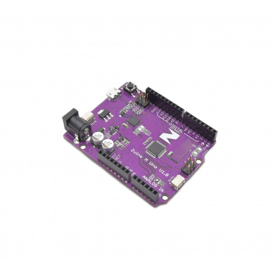

# Zuino M Uno Microcontroller

> This product can be available for purchase [here](https://www.smart-prototyping.com/Zuino-M-UNO.html).

#### Description

Based on the ATmega328, this microcontroller is Arduino and Arduino Uno R3-compatible. Our version of this famously popular microcontroller board integrates a Qwiic connector at either end of the PCB, enabling it to be easily connected with other Qwiic-compatible modules.

The Arduino Uno is the board with which many makers get started. It’s comparatively inexpensive, easy to use, and open source. The worldwide collaborative community, coupled with the easy-to-use IDE, are the primary reasons this microcontroller is the nearly ubiquitous introduction to embedded computing for the last decade. 

This board comes with all of the functions and features that you know and love from the Arduino Uno, with the added bonus of on-board Qwiic capability. The familiar header pins will allow you to use it with any Arduino shield or other modules that lack a Qwiic connector.

Note: you cannot power the Zuino M Uno via Qwiic, as it is a 5v device, and does not include a 3.3v-to-5v boost converter.

#### Specification

* Microcontroller: Atmega328P
* Operating Voltage: 5V
* Input Voltage: 7-12V
* Digital I/O Pins: 14 (6 provide PWM output)
* PWM Digital I/O Pins: 6
* Analog Input Pins: 6
* DC Current per I/O Pin: 20 mA
* DC Current for 3.3V Pin and Qwiic: 50 mA
* Flash Memory: 32KB (0.5 KB is used by bootloader)
* SRAM: 2 KB
* EEPROM: 1 KB
* Clock Speed: 16 MHz
* Dimensions:
* Weight: 18.7g (0.66oz)

#### Links

* [PCB Source file](https://github.com/ZIOCC/Zuino_Uno)

> ###### About Zio
> Zio is a new line of open sourced, compact, and grid layout boards, fully integrated for Arduino and Qwiic ecosystem. Designed ideally for wearables, robotics, small-space limitations or other on the go projects. Check out other awesome Zio products [here](https://www.smart-prototyping.com/Zio).
